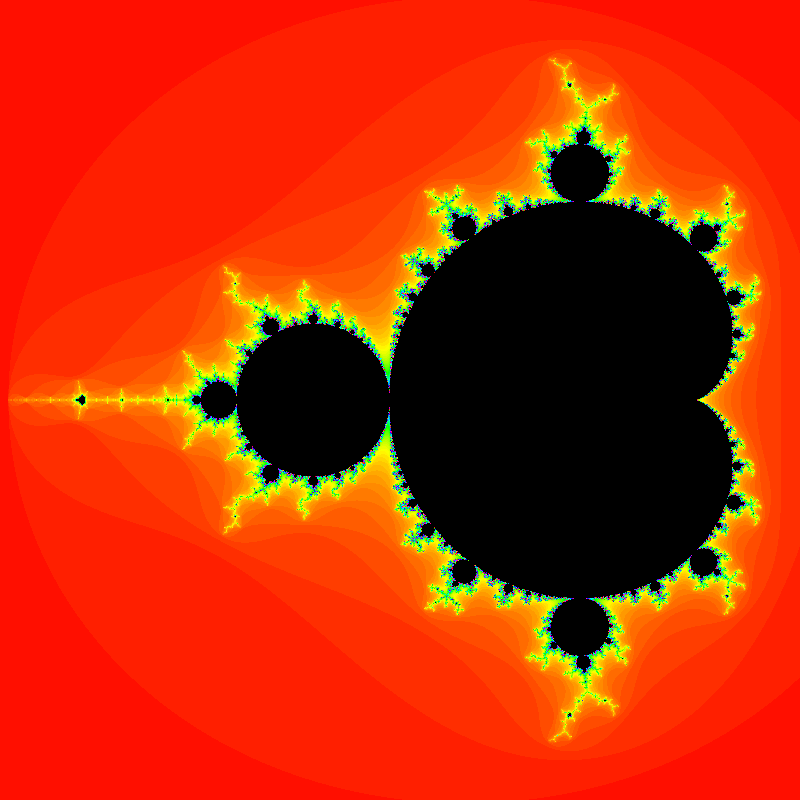
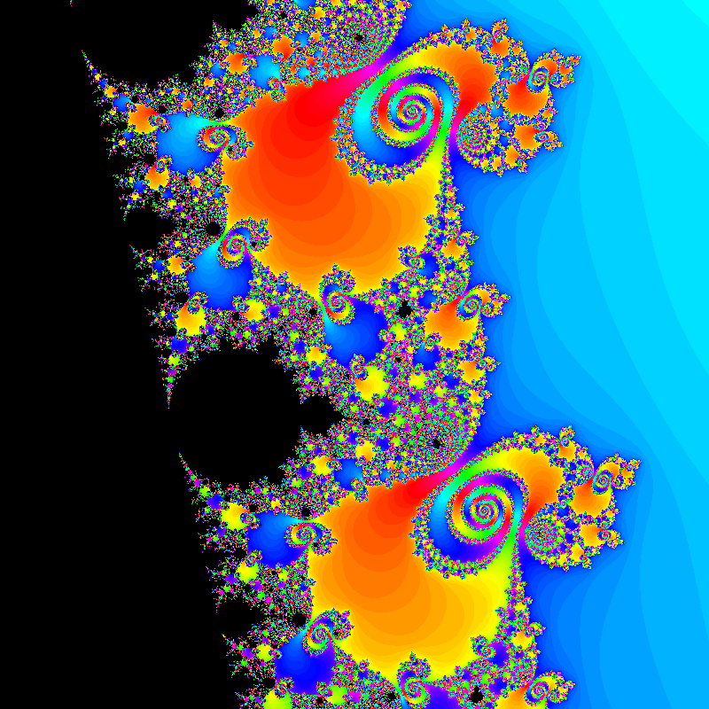
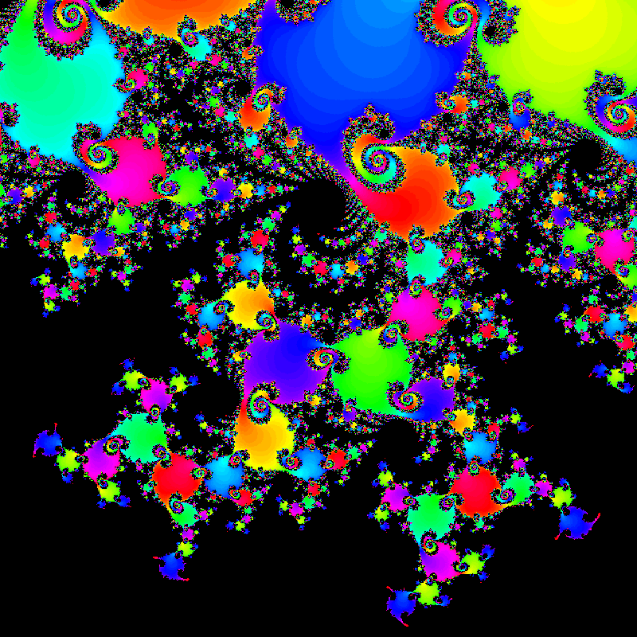

# fractals

A fragment shader based Mandelbrot set visualizer.

### Controls:

| Key | Action |
|---|---|
| Q | Zoom out |
| W | Zoom in |
| Arrow keys | Movement |

### Screenshots

Full Mandelbrot set

x1,000 zoom

x100,000 zoom (some artifacts appear at this point due to 32-bit floating point precision)

